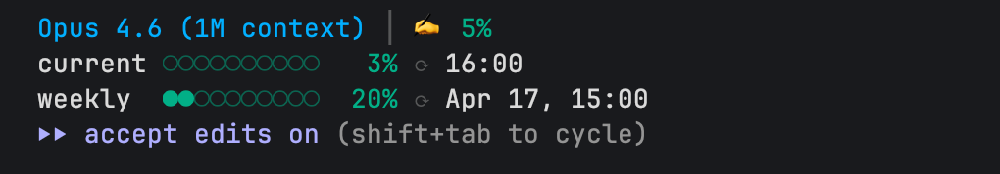

# claude-ratelimit-bar

Custom status line for [Claude Code](https://docs.anthropic.com/en/docs/claude-code) that shows rate limit usage, context window consumption, and session duration at a glance.



## What it shows

**Line 1** — model and context:

```
Opus 4.6 (1M context)  |  ✍️ 5%
```

- Model name
- Context window usage (color-coded: green < 50%, orange 50-69%, yellow 70-89%, red >= 90%)

**Lines 2-3** — rate limits (only when data is available):

```
current  ●○○○○○○○○○   3%  ⟳ 16:00
weekly   ●●○○○○○○○○  20%  ⟳ Apr 17, 15:00
```

- 5-hour sliding window usage with reset time
- 7-day weekly usage with reset datetime
- Same color coding as context window

## Requirements

- `bash`
- `jq`

## Install

```bash
# Copy the script
cp statusline.sh ~/.claude/statusline.sh
chmod +x ~/.claude/statusline.sh

# Add to Claude Code settings (~/.claude/settings.json)
# Merge this into your existing settings:
```

```json
{
  "statusLine": {
    "type": "command",
    "command": "~/.claude/statusline.sh"
  }
}
```

Restart Claude Code to apply.

## How it works

Claude Code pipes JSON with session data to the status line command via stdin. The script parses it with `jq` and formats the output with ANSI colors.

The script reads `rate_limits`, `context_window`, `model`, and `session` fields from the JSON input. No API calls are made — everything comes from the data Claude Code provides.

## License

MIT
